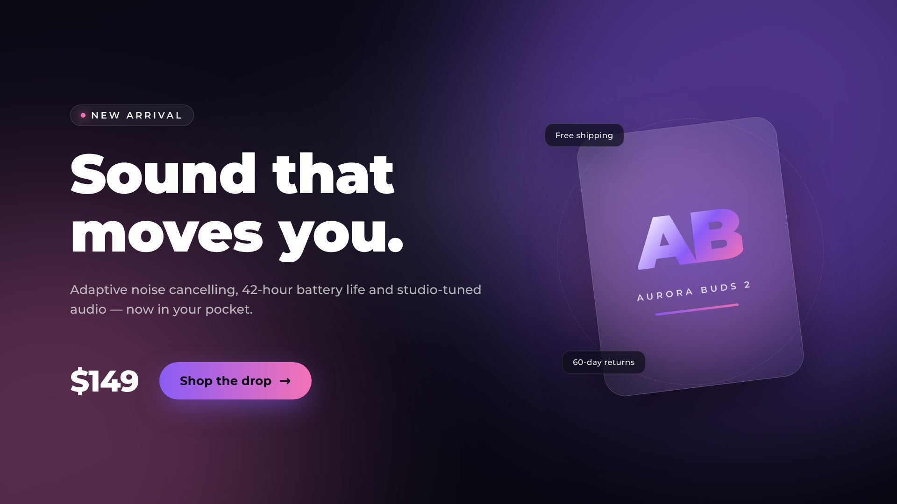
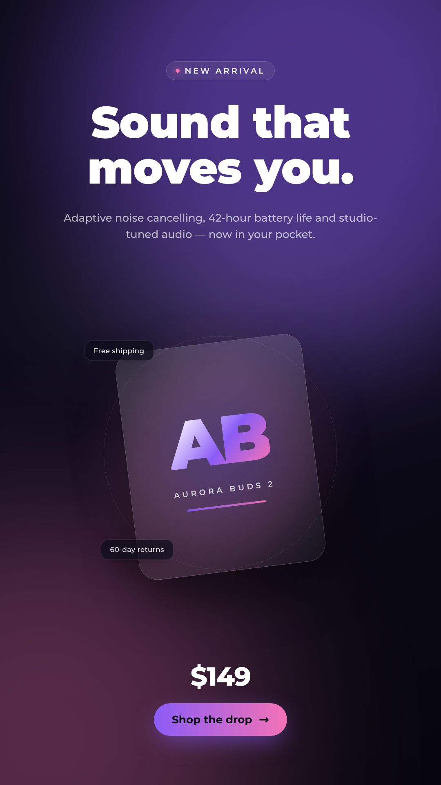
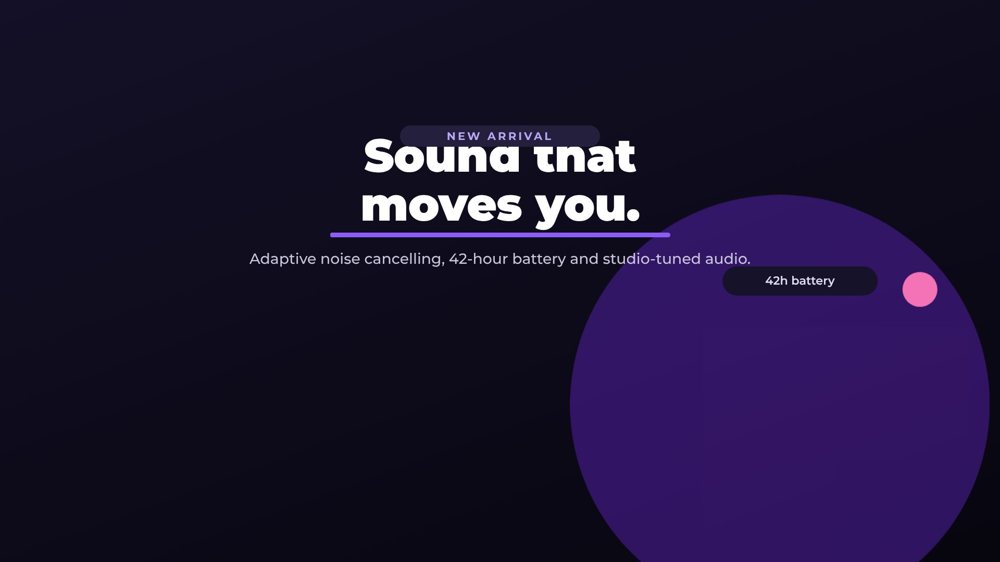
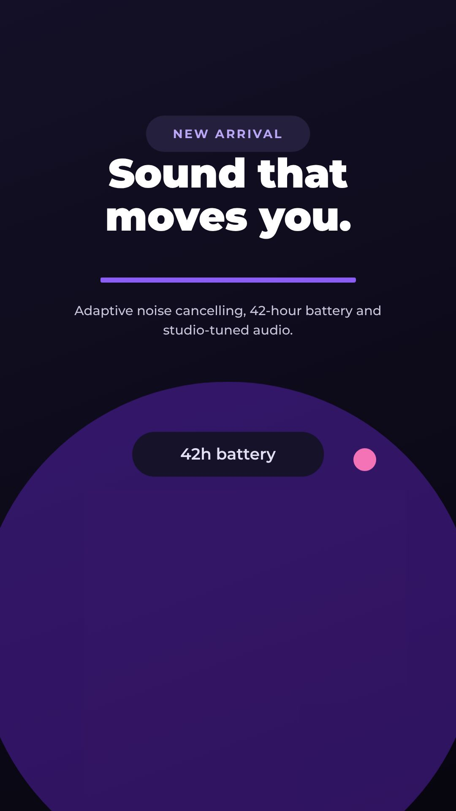

# Areana Video

Programmatic video maker built on **[Remotion](https://github.com/remotion-dev/remotion)** —
write video templates as React components, then render them into MP4s on demand.
Includes a web-based **motion editor** (Alight-Motion-style timeline: layers,
keyframes, easing) whose projects render through the same pipeline.

| Directory    | What it is                                                                 |
| ------------ | -------------------------------------------------------------------------- |
| `remotion/`  | Registered compositions (React + zod schemas) rendered by Remotion         |
| `shared/motion/` | The motion-project **model + evaluation engine** shared by renderer, API and editor |
| `server/`    | Express **render API**: start a job, poll progress, cancel, download MP4    |
| `editor/`    | The **motion editor** web app (bundled with esbuild into `server/public/`)  |
| `public/`    | Assets bundled into renders (vendored Montserrat fonts)                    |
| `scripts/`   | Font sync + editor bundling helpers                                        |

> remotion 4.0.520, React 19. Architecture follows Remotion's official
> [render-server template](https://github.com/remotion-dev/remotion/tree/main/packages/template-render-server).

## What you can do right now

**Product ads** (parameterized text templates — add more by dropping a component
in `remotion/templates/` and registering it in `remotion/Root.tsx`):

- `ProductAd` — 1920×1080, 10 s landscape drop ad (headline, price, CTA…)
- `ProductAdVertical` — 1080×1920, 10 s vertical ad for Reels/Shorts

**Motion editor projects** (rendered from project JSON, up to 10 s at 30 fps):

- `MotionLandscape` — 1920×1080 editor canvas
- `MotionPortrait` — 1080×1920 editor canvas

## 🎬 Motion Editor

Open **http://localhost:3000/editor.html** (link from the render lab, or run
`npm run server` and click “Open the Motion Editor”).

Alight-Motion-style workflow, in the browser:

- **Layers** — text, rectangle and ellipse layers on a gradient/solid background
- **Timeline** — rows per layer with a ruler, draggable playhead, play/pause
  (space), arrow-key stepping, per-property **keyframe diamonds** (drag to move,
  double-click to delete)
- **Keyframed properties** — X, Y, scale, rotation and opacity, each with its
  own easing curve (linear, ease-in/out quad & cubic, back…)
- **Inspector** — edit text, font size/weight/align, colors, shape geometry, and
  add/edit/delete keyframes at the playhead
- **Live preview** — the canvas plays through `@remotion/player` using the exact
  same component the renderer uses
- **Export** — “Render MP4” validates the project, queues a job on the render
  API (frame-trimmed to the project duration) and shows the finished video

The default demo project doubles as an API example: every editor project is
plain JSON matching the zod schema in `shared/motion/model.ts`.

## Previews

Rendered stills (frame 150 of 300):

| Product ad 16:9 | Product ad 9:16 | Motion editor demo 16:9 | Motion editor demo 9:16 |
| --- | --- | --- | --- |
|  |  |  |  |

## Quickstart

```console
npm install                 # deps (+ postinstall: fonts + editor bundle)
npm run server              # render API + web UI + motion editor (localhost:3000)
npm run studio              # Remotion Studio: inspect all compositions (localhost:3001)
npm run render:demo         # render the product-ad demo straight to out/product-ad.mp4
npm run editor:watch        # rebuild editor bundle on change (dev)
```

The first CLI render or server start downloads Remotion's tested headless
Chrome automatically (needs internet, ~150 MB, cached in
`node_modules/.remotion`).

## Render API

```
POST   /api/jobs              start a render
GET    /api/jobs              list jobs
GET    /api/jobs/:id          job status + progress
DELETE /api/jobs/:id          cancel a queued/running job
GET    /renders/<jobId>.mp4   download the finished video
GET    /api/templates         template + motion preset metadata
```

Text-template job:

```console
curl -s -X POST localhost:3000/api/jobs \
  -H 'Content-Type: application/json' \
  -d '{
    "templateId": "ProductAd",
    "props": {
      "productName": "Nebula Watch",
      "headline": "Time, redesigned.",
      "price": "$199",
      "ctaText": "Pre-order now",
      "accent": "#22D3EE",
      "accent2": "#8B5CF6"
    }
  }'

curl -s localhost:3000/api/jobs/<jobId>     # poll → { status: "in-progress", progress: 47 }
```

Motion-project job (project JSON from the editor, or any valid motion project):

```console
curl -s -X POST localhost:3000/api/jobs \
  -H 'Content-Type: application/json' \
  -d '{
    "templateId": "MotionLandscape",
    "props": {
      "project": { "version": 1, "width": 1920, "height": 1080, "fps": 30,
                   "durationInFrames": 120, "background": { "type": "solid", "color": "#0b0a14" },
                   "fontFamily": "Montserrat", "layers": [] }
    }
  }'
```

The server validates the payload against the zod schema, checks the canvas
matches the preset, and trims the render to the project's duration.

### Environment variables

| Variable                | Default                | Meaning                                                                  |
| ----------------------- | ---------------------- | ------------------------------------------------------------------------ |
| `PORT` / `HOST`         | `3000` / `0.0.0.0`     | HTTP bind address                                                        |
| `BROWSER_EXECUTABLE`    | *(auto-download)*      | Path to a Chrome/Chromium binary to use for rendering                    |
| `REMOTION_SERVE_URL`    | *(bundles on boot)*    | Reuse an already-bundled Remotion site (`remotion bundle`)               |
| `PUBLIC_BASE_URL`       | *(relative URLs)*      | Base URL used in job `downloadUrl` values                                |

## Rendering in a browser-less / offline CI

Remotion renders with headless Chrome. If your machine can't download it
(restricted network), point `BROWSER_EXECUTABLE` at any modern Chromium:

```console
BROWSER_EXECUTABLE=/path/to/chromium npm run server
```

This repo was verified end-to-end against a Chromium 149 binary fetched from
the npm registry and run with its bundled shared libraries (see
`server/index.ts` → `ensureBrowser({ browserExecutable })`). The same env var
is picked up by `remotion.config.ts` for CLI commands.

## Project layout

```
remotion/
  index.ts                  entry point (registerRoot)
  Root.tsx                  <Composition> registry — template + motion ids
  lib/fonts.ts              vendored Montserrat loader (offline-safe)
  lib/motion.tsx            animation helpers for the product-ad templates
  templates/ProductAd.tsx   schema + defaults + component (handles 16:9 & 9:16)
shared/motion/
  model.ts                  zod project model: layers, keyframes, easing
  engine.ts                 pure evaluation: values/styles at any frame
  MotionProjectView.tsx     the component that renders a project (Remotion)
server/
  index.ts                  Express app + job endpoints + static UI
  queue.ts                  FIFO render queue (single worker, cancel support)
  templates.ts              template + motion preset registry for the API/UI
  public/                   render lab (index.html) + editor shell (editor.html)
editor/
  main.tsx / app.tsx        editor boot + state, playback, export
  Timeline.tsx              layer rows, keyframe diamonds, ruler, playhead
  Inspector.tsx             per-layer properties + keyframe editing
  editor.css                styles (bundled by esbuild → server/public/main.css)
scripts/
  copy-fonts.mjs            vendored Montserrat woff2 → public/fonts
  build-editor.mjs          esbuild bundle editor → server/public
```

## Adding a template / composition

1. Text template: create `remotion/templates/YourTemplate.tsx` (zod schema +
   `defaultProps`, colors via `zColor()`), register a `<Composition>` in
   `remotion/Root.tsx`, then add metadata in `server/templates.ts`.
2. Motion preset: any project JSON is already renderable through
   `MotionLandscape` / `MotionPortrait` — to add a canvas size, register a new
   `<Composition>` plus a matching `MOTION_PRESETS` entry.

Studio, render API and editor pick everything up automatically.

## Production notes

- The queue is in-memory and renders **one job at a time** — perfect for a
  hobby/demo server. For production, persist jobs (Postgres/Redis), use a real
  queue (BullMQ/SQS), run workers on more/faster CPUs, and store outputs in an
  object store (S3). Remotion also offers [Lambda rendering](https://www.remotion.dev/docs/lambda)
  for scale-to-zero video generation.
- Fonts are vendored (see `scripts/copy-fonts.mjs`, sourced from the OFL
  `@fontsource/montserrat` package) so renders never depend on a font CDN.
- Video codec is H.264 (`codec: "h264"` in `server/queue.ts`). `@remotion/renderer`
  supports WebM/VP8/VP9, ProRes and more.
- The editor bundle (`server/public/main.{js,css}`) is a build artifact — it is
  recreated by `npm run editor:build` (also wired into `postinstall`) and is
  not committed.

## Useful links

- Remotion repo: https://github.com/remotion-dev/remotion
- Remotion docs: https://www.remotion.dev/docs
- Render server template this is based on:
  https://github.com/remotion-dev/remotion/tree/main/packages/template-render-server
- Alight Motion (design inspiration for the editor UX): https://alightmotion.com
